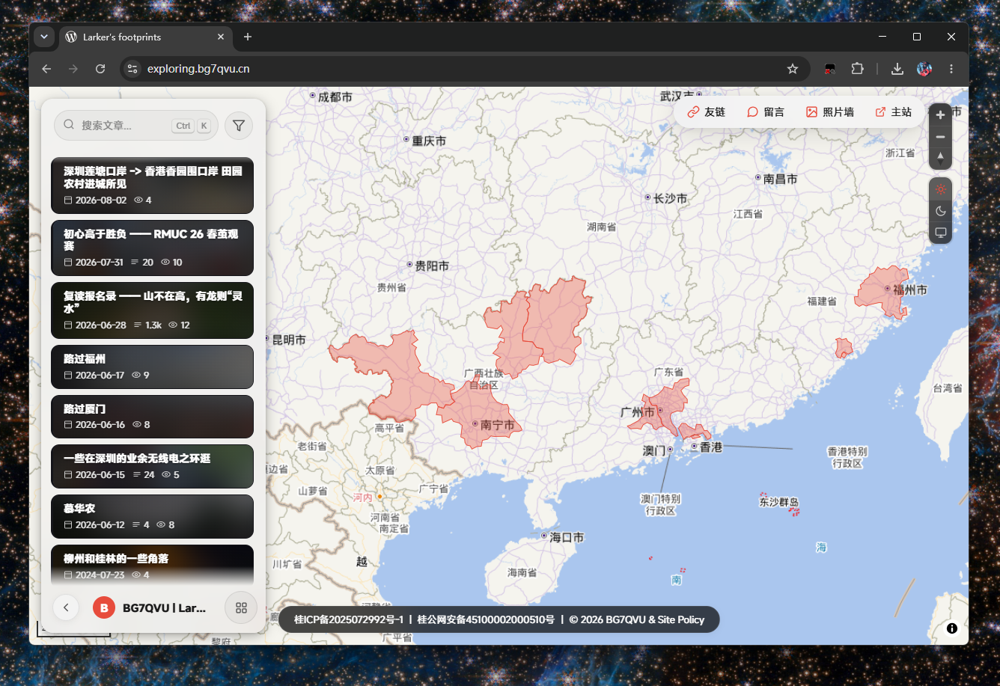
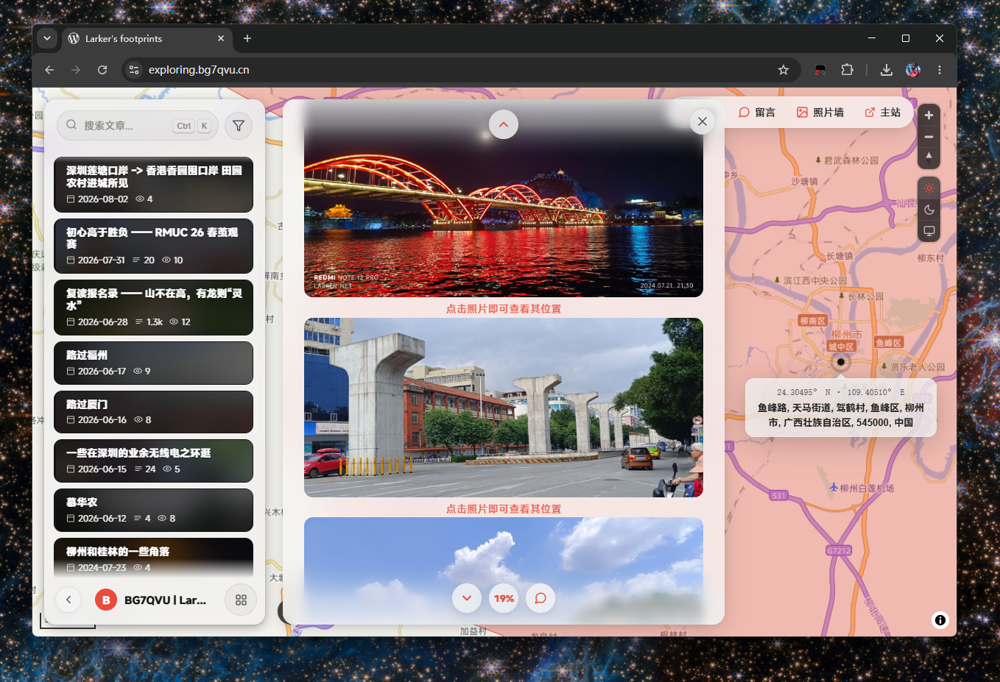

[简体中文](README_zh-CN.md) | **English** | [日本語](README_jp.md)

# SphotographySP

SphotographySP — A fullscreen map-based WordPress photography theme that turns content into exploration




# Status

> Core idea: **Manage content in the backend; explore it on the frontend.** Visitors arrive at a vector map filling the viewport. Each geotagged photo becomes a map marker: click to open its article, jump to the relevant page, and fly to its coordinates. Development is ongoing; pull requests and issues are welcome.

The SP edition is a fork maintained by [Larker](https://github.com/LarkerO), aiming to provide additional support, a more modern frontend, and writing that feels less AI-generated than the [original Sphotography project](https://github.com/ShirazuNagisa/sphotography/).

# Features

+ **Fullscreen map exploration** — A MapLibre GL JS vector map serves as the homepage, with CartoDB basemaps (Dark Matter / Positron) and no API token required. Photos appear as droplet markers; nearby points merge and split in real time with a gooey filter.
+ **Night mode** — Follow the system, force light, or force dark; dark palettes include Classic, Blue, and Purple.
+ **Sidebar and articles** — Expandable sidebar, instant search (`Ctrl / ⌘ + K`), category and region filters, full articles loaded through REST, and Windows DWM-style window expansion animations.
+ **Photo wall** — Article photos grouped by date, pinned items, infinite scrolling, and detail overlays showing aperture, shutter speed, and ISO. “View shooting location” flies to the photo on the map.
+ **Map integration** — Clicking a marker opens a photo grid that follows the map. On desktop, selecting a photo opens its article with a window animation and navigates to the relevant section. Clicking a geotagged article image pans and zooms the background map to a 5 km/cm scale beside the panel.
+ **Custom comment system** — REST architecture with CAPTCHA, private comments, email notifications, Markdown, emoji, likes, pins, edit history, user-agent details, IP regions, text avatars, collapsing, and pagination.
+ **Friend links and guestbook** — Reuses WordPress link management, with automatic mShots thumbnails, link submissions and approval. The guestbook shares the comment engine.
+ **AI module (experimental)** — Bring your own API key, stored with AES-256 encryption and used only on the server. Article completion and polishing with adjustable tone and length, full-article summaries, automatic tags, and single- or dual-model multimodal writing from images, producing native block HTML.
+ **Social sharing** — WeChat QR codes, QQ, Qzone, Weibo, X, Facebook, and copy link, with monochrome icons in the theme color.
+ **Languages** — Frontend 中 / A / あ switching, a static dictionary, on-demand model translation, and server caching. Article translations are generated when saving.
+ **Statistics** — Detailed sidebar statistics, regional pie charts, masonry article lists, word counts, and view counts on cards.
+ **Regional coloring** — `region_tag` taxonomy, administrative boundaries downloaded and hosted on demand, regional filters and area counts, and map theme-color filters.
+ **Finishing touches** — Rounded magnetic cursor inspired by iPad, floating announcements with optional auto-close, article tables of contents, reading progress, page-link navigation, blurred article-cover backgrounds, and more.
+ **Configuration export / import** — One-click JSON export and import of all settings, including plaintext round-tripping of encrypted API keys, friend links, guestbook settings, and regional colors.
+ **Administration** — Dedicated top-level settings page, one-click EXIF extraction (GPS / camera / date), CDN selection (jsDelivr / unpkg / cdnjs), one-click updates from a GitHub branch, and optional Sphotography admin styling.
+ **Technical details** — Vanilla JavaScript without frameworks or global namespace pollution; REST and inline PHP data channels with automatic fallback on 403; CSS-variable design tokens; three responsive breakpoints; accessibility support and respect for reduced-motion preferences.

# Installation

Download the .zip file from [Releases](https://github.com/LarkerO/sphotography/releases), then upload, install, and activate it under “Appearance → Themes” in WordPress.

On activation, the theme registers the `region_tag` taxonomy, creates the “Fullscreen Map” page template, and sets it as the static homepage.

# Repository layout and packaging

Theme sources live directly at the repository root: `style.css`, `functions.php`, `index.php`, `template-map.php`, `admin/`, `inc/`, and `assets/`. The `tests/`, `scripts/`, and `promo/` directories contain development or promotional materials.

Run from the repository root:

```powershell
pwsh -File ./scripts/package-theme.ps1
```

This creates `dist/Sphotography.zip`, with one enclosing `Sphotography/` theme directory. Install it through “Appearance → Themes → Add New Theme → Upload Theme” in WordPress. The script packages only runtime files, screenshots, and licenses, excluding tests, build caches, promotional assets, and old archives. The admin updater supports the current root layout and older nested releases.

# Changelog

## 20260926 v1.6 SP

+ Moved theme sources to the repository root; added one-command packaging and compatibility with older update layouts.

+ Combined profile information and sidebar bottom controls into one row to give articles more room; moved Theme / GitHub below uptime in the statistics panel.
+ Unified map zoom, appearance, and language controls with the sidebar’s light/dark, rounded, and glass styles. Removed the compass and disabled mouse, touch, and keyboard rotation to keep north up.
+ Fixed selected fonts not applying to WordPress global admin styling and theme settings; webfonts and self-hosted sources now apply there too.

+ Added thumbnail replacement at any time through “Social → Friend Links” using the media library or uploads, with automatic saving. Background fetching preserves manual replacements.
+ Added drag handles for friend-link sorting with automatic saving and frontend synchronization. Dragging clears existing pins; pin buttons remain available. Failed saves restore the previous order and show a message.
+ Added ICP and public-security registration numbers and lookup links in Footer settings. Displays “registration number | custom footer content”, hides empty items, and wraps on narrow screens.
+ Changed footer links to white without underlines, turning gray on hover or keyboard focus.
+ Added MiSans and HarmonyOS Sans options, loading pinned third-party jsDelivr webfonts only when selected. A self-hosted CSS URL can replace the default source; failed loads fall back to system fonts.
+ Fixed font settings not applying to the homepage “Search articles…” field and expanded-page search, including placeholders.
+ Fixed screenshot retries not resetting on refetch and slow background fetches overwriting friend-link order.

Font deployment: default sources are [misans-webfont](https://github.com/mobeicanyue/misans-webfont) (4.3.1, character subsets) and [harmonyos-fonts](https://github.com/IKKI2000/harmonyos-fonts) (pinned commit; full Chinese font files are larger). Production sites can host the selected CSS and referenced font files on their own static domain and enter the CSS URL under “Frontend font”. Preserve the MiSans / HarmonyOS Sans SC family names and configure font MIME types and cross-origin access. Keep self-hosted files outside the theme directory to avoid overwriting them during upgrades.

## 20260806 v1.5.01

+ Fixed article content failing to render when opened directly through a shared link. Single-article URLs now load map assets and open the corresponding article panel automatically.
+ Fixed update checks failing to recognize versions such as v1.4.91; version numbers with any number of segments are now compared correctly.

## 20260720 v1.4.9

+ Added global JSON settings export / import, including plaintext round-tripping of encrypted API keys, friend links, guestbook settings, and regional colors.
+ Added variable-sized masonry article cards.
+ Changed expanded-list / article transitions to a two-screen sliding layout.
+ Added cursor attraction to the expand button and lengthened the expanded-page search field.
+ Fixed profile expansion, duplicate region counts, overlapping admin search icons, and related issues.

## 20260720 v1.4.8

+ Added large expanded-sidebar cards with detailed statistics, regional pie charts, and a masonry article list.
+ Removed the profile card in favor of the sidebar; added pill-shaped search and a circular filter button.
+ Widened the article TOC, added accordion scroll tracking, and aligned it to the top.
+ Fixed announcement title wrapping and related issues.

## 20260720 v1.4.7

+ Adjusted announcement spacing; redesigned and fixed the TOC.
+ Added regional defaults and admin boundary downloads; made the map the homepage.
+ Added PingFang / Songti fonts and an iPad-style dot cursor.
+ Improved lazy loading and fixed overlapping admin search icons.

## 20260719 v1.4.6

+ Added article indexing and geocoding generation on save.
+ Redesigned announcements; added FLIP filter animations and a circular GitHub icon.
+ Added geotagged-photo labels, fading photo-wall buttons, and admin settings search.
+ Added a collapsed-sidebar avatar, blurred cover backgrounds, and article TOCs.

## 20260719 v1.4.5

+ 🖱️ Added an iPad-inspired rounded magnetic cursor.
+ Added automatic announcement closing.
+ Fixed location-overlay transform conflicts; made the scroll-down button reach 100% reading progress and anchored the close button to the overlay.
+ Reorganized repository files, moving sources into Sphotography/.

## 20260719 v1.4.4

+ Added floating announcement panels.
+ Pre-generated article translations on save.
+ Made reading progress reach 100% at the midpoint, hid the three-button group, and fixed the close button while scrolling.
+ Displayed location overlays below pulse markers via the reverse-geocoding proxy; closed map photo panels when flying to a location.
+ Standardized code comments.

## 20260719 v1.4.3

+ 🌐 Added 中 / A / あ language switching with a static UI dictionary, on-demand model translation, and server caching.
+ Fixed nested forms in settings, restoring homepage behavior and saving.
+ Moved social settings to the end of the page.

## 20260719 v1.4.2

+ Rebuilt settings with separate section cards, an accordion index, smooth sliding, SVG placeholders, and preview cards.
+ Made sidebar buttons consistently circular.
+ Added iOS-style fluid pills to page-link navigation.
+ Faded bottom frosted-glass areas at the end of articles, friend links, and the photo wall.
+ Changed friend-link creation to a centered modal.
+ Fixed emoji insertion in comments, settings index layout, and related issues.

## 20260718 v1.4.1

+ Flattened the settings-page layout.
+ Switched the photo wall to the Web Animations API to eliminate flicker.
+ Portaled overlays to the body to prevent clipping.

## 20260718 v1.4.0

+ Added a circular photo-wall trigger and overlay, regional filtering, and EXIF backfill tools.
+ Ran the AI typewriter effect on each invocation; added second-level settings navigation.
+ Fixed settings layout and added server-side friend-link validation.

## 20260718 v1.3.9

+ 🖼️ Added the photo wall with article photos, date grouping, pins, infinite scrolling, details, and location viewing.
+ Added EXIF aperture, shutter speed, and ISO.
+ Added full-width admin settings rows and a non-sticky preview; kept the panel’s right edge clear of controls.
+ Fixed circular styling issues in friend links and the guestbook.

## 20260718 v1.3.8

+ Fixed friend-link and guestbook administration and integrated it into settings.
+ Reorganized settings categories with a sticky live preview.
+ Added FLIP expansion to page links; closed panels on blank-area clicks or map flights.
+ Fixed light-mode inputs and duplicate image-list popups.

## 20260718 v1.3.7

+ Added separate desktop/mobile defaults for sidebar expansion.
+ Added page-link navigation (friend links / guestbook / external sites), a friend-links page with mShots and application review, and a guestbook using the comment engine.
+ Added frosted transitions at article edges and changed WeChat QR codes to inline SVG.
+ Added comment sorting by time / likes and a Markdown toolbar.

## 20260717 v1.3.6

+ 🤖 Added AI article summaries with asynchronous generation, a first-open typewriter effect, and an admin toggle.
+ Moved AI completion and polishing into an editor review overlay with colored typewriting and word-level revision highlighting.
+ Fixed scroll buttons staying stationary relative to the page frame.

## 20260717 v1.3.5

+ Added an optional article view counter and word / view counts on sidebar cards.
+ Added unsaved-change protection when leaving.
+ Added article scroll controls for top, bottom, progress percentage, and comments.
+ Added monochrome theme-colored sharing icons with a WeChat QR code on hover; fixed native text in dark admin mode.

## 20260717 v1.3.4

+ Added comment IP regions using an offline database and lazy lookup.
+ Added article writing locations using browser geolocation and offline reverse lookup.
+ Added social sharing: WeChat QR, QQ, Qzone, Weibo, X, Facebook, and copy link.
+ Fixed admin colors: native text in light mode, striped lists in dark mode, and consistent light text on dark editor backgrounds.

## 20260717 v1.3.3

+ Added three layers of frontend WordPress toolbar hiding to prevent overridden filters from restoring it.

## 20260717 v1.3.2

+ Added a three-way appearance switch and click-to-expand profile information in cards or the sidebar.
+ Added custom links and fading transitions at sidebar boundaries.
+ Hid the frontend WordPress admin toolbar.

## 20260717 v1.3.1

+ 💬 Rebuilt comments with a custom REST system.
+ Added CAPTCHA, private comments, email notifications, Markdown, emoji, likes, pins, edit history, user-agent details, text avatars, collapsing, and pagination.

## 20260717 v1.3.0

+ 🤖 Added AI completion / polishing with adjustable style and length.
+ Added single- and dual-model multimodal support.
+ Fixed light-mode editor panels.

## 20260717 v1.2.9

+ Added an experimental AI module with user-supplied keys and encrypted storage.
+ Made a single sidebar row the default profile layout.

## 20260716 v1.2.6 ~ v1.2.8

+ Changed administrative boundaries to on-demand downloads into uploads instead of bundling them with the theme.
+ Increased boundary-download timeouts and improved stability.

## 20260716 v1.2.4

+ Added reading information, map-style settings, and theme-color map filters.

## 20260715 v1.2.0

+ Changed the primary color to teal.
+ Fixed readability of admin settings controls in dark mode.
+ Enabled global Sphotography admin styling by default.

## 20260715 v1.1.7

+ Added Windows DWM-style article minimize / restore animations.
+ Added the Noto Serif SC font.
+ Added full Gutenberg compatibility and collapsed the sidebar by default.

## 20260714 v1.1.3 ~ v1.1.6

+ Rebuilt photo grids as dynamic multi-panel layouts and removed the supercluster dependency.
+ Reduced the clustering radius and added split / merge animations.
+ Added FLIP animations, cluster transitions, and mutually exclusive grids.
+ Refined the frontend with animation tokens, consistent buttons, glass layers, and branded loading visuals.

## 20260713 v1.1.0 ~ v1.1.2

+ Improved cluster interaction and location tracking; used a single grid and displayed only photos from published articles.
+ Redesigned the sidebar footer and fixed cluster interaction.

## 20260713 v1.0.4

+ Fixed night-mode bugs.
+ Added an editable footer.
+ Added map-marker validation.

## 20260713 v1.0.1

+ Added a light basemap and sidebar overlay.
+ Adjusted the “About” button position.

## 20260713 v1.0.0

+ Stable release.
+ Added a GitHub updater and inline-data fallback.
+ Added automatic EXIF GPS detection in the media library and editable coordinates, camera, and date fields.

# License

The current version is licensed under **GPL-3.0-only**. See [LICENSE](LICENSE) for the full text.

The original project declared “GPL v2.0 or later”, but the repository did not include the license text. The original declaration is recorded in [LICENSE.original.md](LICENSE.original.md), and the official GNU GPL v2 text is preserved in [LICENSE-GPL-2.0.original.txt](LICENSE-GPL-2.0.original.txt) for historical reference only.